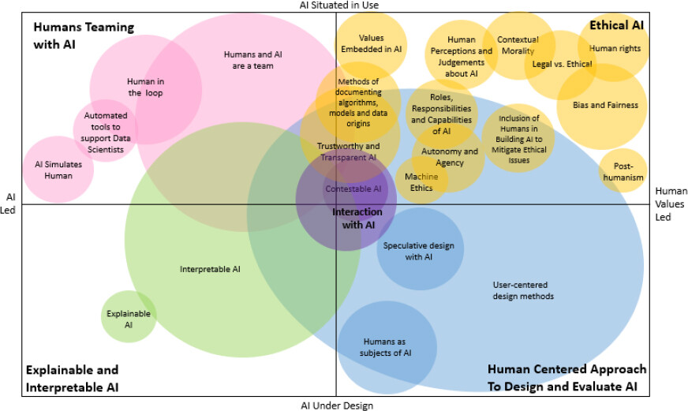
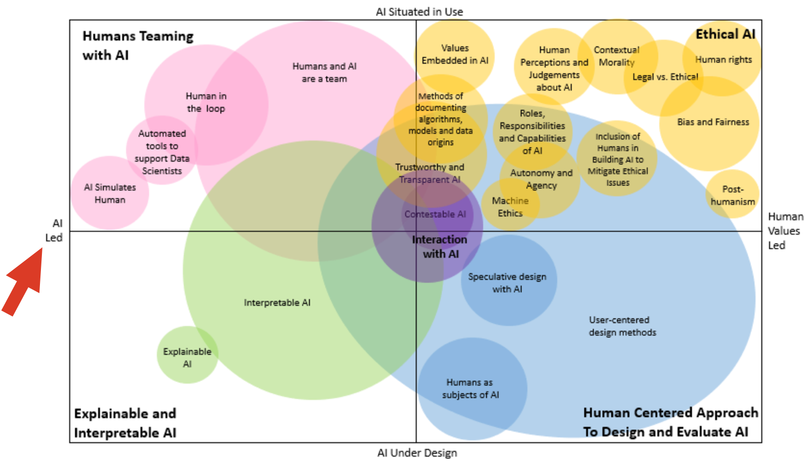
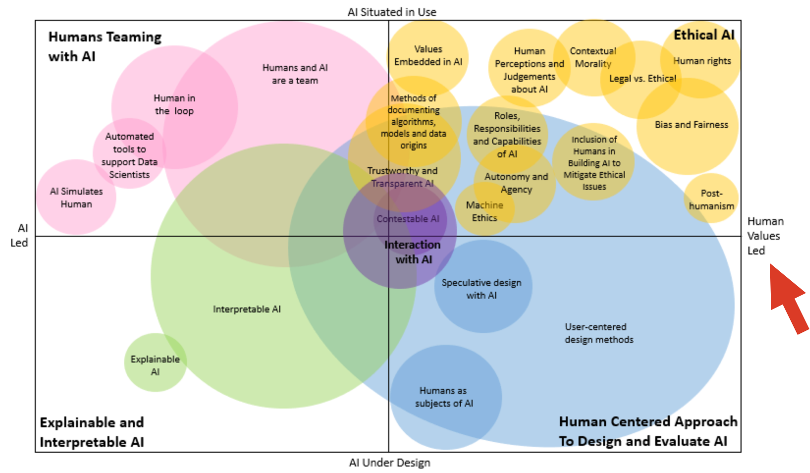
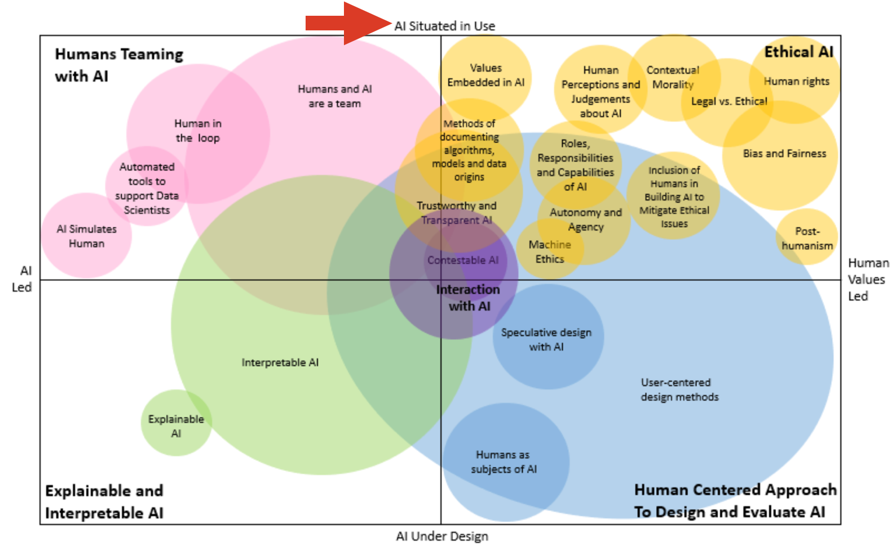
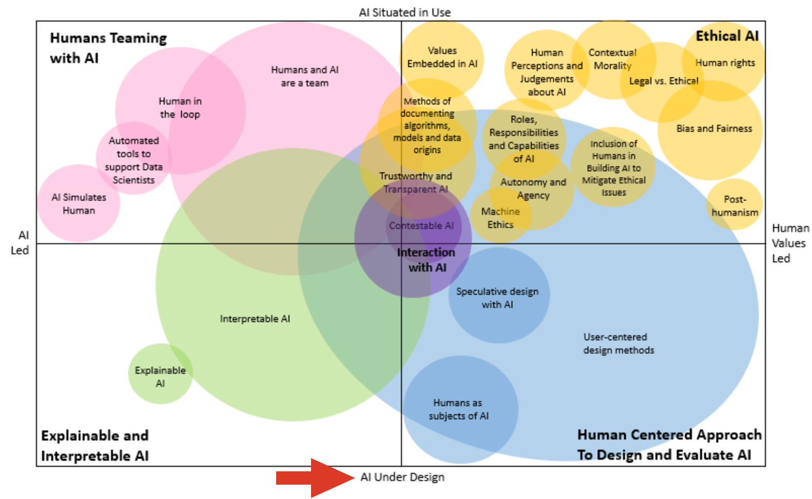
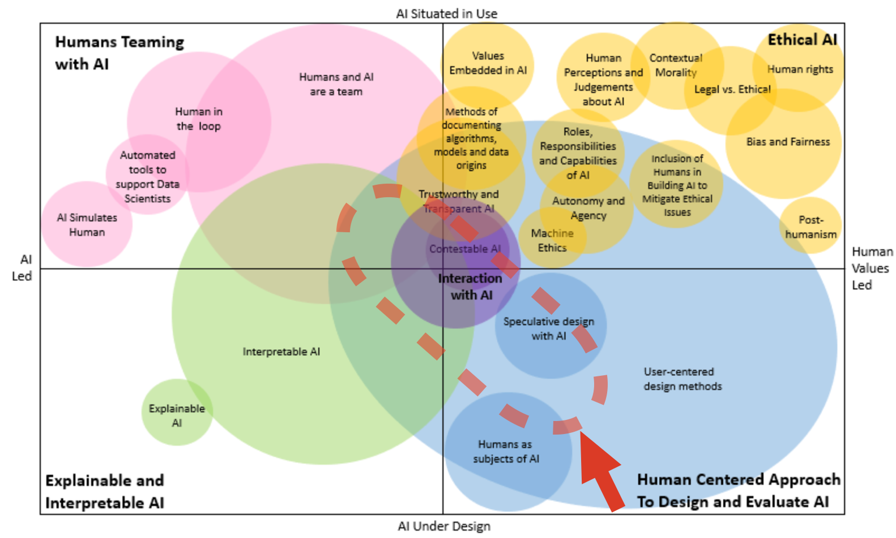
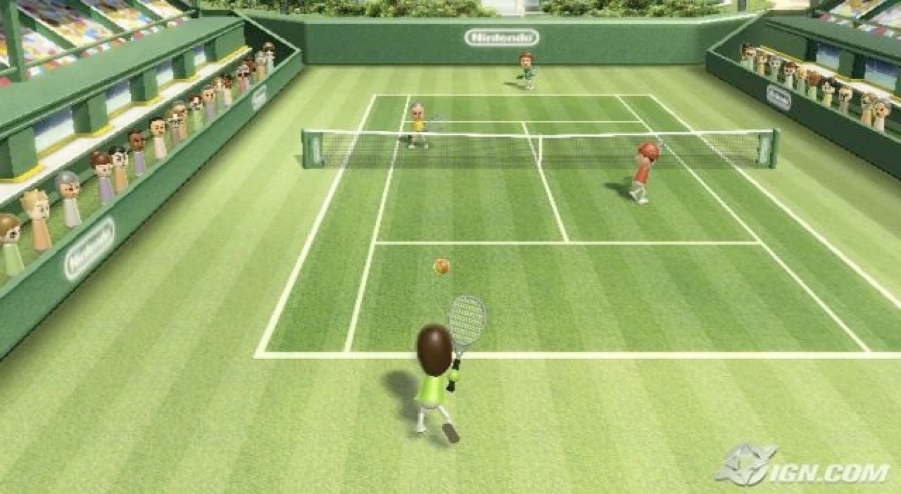
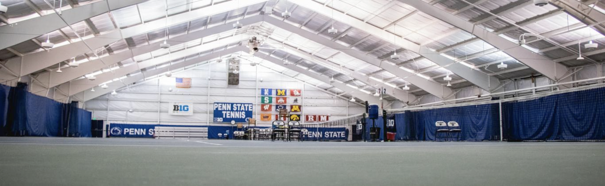

# IST 597 (001) Human Centered Artificial Intelligence ([HCAI]{.t-clover})
::: {.t-left}
Saeed Abdullah (saeed@psu.edu)
:::

---

## Introduction
* Associate Professor in IST

* Research
	- Digital Health
	- Human Computer Interaction (HCI)
	- Human-centered AI

* Wellbeing & Health Innovation [(WHI)](https://whilab.org/) lab

---

## Teaching assistant

{.profile style="max-width: 20%;" alt="Profile picture of Yunkai Xu"}

---

## What is HCAI?

---

“[HCAI] utilizes data to [**empower and enable its human users**]{.t-clover}, while revealing its underlying values, biases, limitations, and the ethics of its data gathering and algorithms to foster ethical, interactive, and contestable use”

:::{.t-ref}
[Capel et al.](https://doi.org/10.1145/3544548.3580959)
:::

---

“[HCAI] is an emerging discipline intent on creating AI systems that [**amplify and augment rather than displace human abilities**]{.t-clover}. HCAI seeks to preserve human control in a way that ensures artificial intelligence meets our needs while also operating transparently, delivering equitable outcomes, and respecting privacy.”

:::{.t-ref}
[Geyer et al.](https://archive.is/weAVx)
:::

---

“HCAI focuses on [**amplifying, augmenting, and enhancing human performance**]{.t-clover} in ways that make systems reliable, safe, and trustworthy”

:::{.t-ref}
[Shneiderman, B.](https://doi.org/10.1145/3419764)
:::

---

### HCAI landscape

:::{.columns style="justify-content: center; align-items: center; align-items: center;"}
:::{.column style="background-color: #ffff; max-width:60%;"}
{alt="Map of the field of HCAI. The bubbles reflect the relative number of papers found in each area."}
:::
:::

“Map of the field of HCAI. The bubbles reflect the relative number of papers found in each area.”

:::{.t-ref}
[Capel et al.](https://doi.org/10.1145/3544548.3580959)
:::

---

### AI led vs. human-values led

:::{.columns style="justify-content: center; align-items: center; align-items: center;"}
:::{.column style="background-color: #ffff; max-width:60%;"}
{alt="Map of the field of HCAI. The bubbles reflect the relative number of papers found in each area."}
:::
:::

[**AI led**]{.t-salmon}: "foregrounding the AI or algorithmic techniques themselves in service of AI products"

:::{.t-ref}
[Capel et al.](https://doi.org/10.1145/3544548.3580959)
:::

---

### AI led vs. human-values led

:::{.columns style="justify-content: center; align-items: center; align-items: center;"}
:::{.column style="background-color: #ffff; max-width:60%;"}
{alt="Map of the field of HCAI. The bubbles reflect the relative number of papers found in each area."}
:::
:::

[**Human led**]{.t-salmon}: "foregrounding human values and concerns"

:::{.t-ref}
[Capel et al.](https://doi.org/10.1145/3544548.3580959)
:::

---

### Situated in use vs. under design

:::{.columns style="justify-content: center; align-items: center; align-items: center;"}
:::{.column style="background-color: #ffff; max-width:60%;"}
{alt="Map of the field of HCAI. The bubbles reflect the relative number of papers found in each area."}
:::
:::

[**Situated in use**]{.t-salmon}: "AI being studied in use in society to reveal its flaws, limitations, and challenges"

:::{.t-ref}
[Capel et al.](https://doi.org/10.1145/3544548.3580959)
:::

---

### Situated in use vs. under design

:::{.columns style="justify-content: center; align-items: center; align-items: center;"}
:::{.column style="background-color: #ffff; max-width:60%;"}
{alt="Map of the field of HCAI. The bubbles reflect the relative number of papers found in each area."}
:::
:::

[**Under design**]{.t-salmon}: "Being designed to address specific needs"

:::{.t-ref}
[Capel et al.](https://doi.org/10.1145/3544548.3580959)
:::

---

## Focus of this class

:::{.columns style="justify-content: center; align-items: center; align-items: center;"}
:::{.column style="background-color: #ffff; max-width:60%;"}
{alt="Map of the field of HCAI. The bubbles reflect the relative number of papers found in each area."}
:::
:::

:::{.t-ref}
[Capel et al.](https://doi.org/10.1145/3544548.3580959)
:::

---

## Focus of this class

* More focus on designing and implementing
    + Rather than critiquing “situated in use”

* Interdisciplinary and applied focus
    + We won’t fine tune large language models (LLMs)
    + Instead, we will develop and evaluate user-focused systems using existing LLMs

---

### Learning Objectives

* Identifying societal challenges and opportunities of emerging AI applications
* Assessing requirements, approaches, and goals for human-centered AI
* Applying principles and methods for creating and evaluating human-centered AI systems

---

## Course requirements

---

### Programming requirement (python)

* Will require some programming experience in python
    * We will use OpenAI APIs to build systems
    * Basic understanding of python should be adequate
* [IST peer-tutoring](https://learning.ist.psu.edu/tutoring/university-park) can be useful, if necessary

---

### No textbook, but you'll need OpenAI API access

* You will have to pay for the access
    - Start with $5
* We will talk about creating API keys and access later

---

## Course structure

---

### Course grading
* Class activities — 30%
* Assignment — 20%
* Final Project — 50%

---

### Class Activity

* Interactive discussions following assigned readings
    * Readers
    * Discussion leaders

---

#### Readers
* [**24 hours before the class**]{.t-salmon}
    - Add a slide for each assigned reading in [Google Drive](https://drive.google.com/drive/folders/12-aHbC4HN9gVYCXWFzdZ64QXGaUMnrKy)
    - Discussion leaders will use these slides

---

#### Readers

* There is [one folder for each class](https://drive.google.com/drive/folders/12-aHbC4HN9gVYCXWFzdZ64QXGaUMnrKy)
* Each of these folders have one slide deck for each assigned readings
    * For example, [Week 3](#week-3-0130-when-is-ai-useful) has two decks: [one for Vaccaro et al.](https://drive.google.com/drive/folders/1sETSMYcz0s7fcEdKZcaHPiqBXelLsu1-) and [another for Lee et al.](https://drive.google.com/drive/folders/1EyVHMBmZSxTcM-15gVtt3xsCUj4J1MZp)

---

#### Readers will create one slide per article
* Respond in 1-2 sentences to the following categories
	* Contributions — What are the main contributions here?
	* Insights — What did you learn or find compelling?
	* Surprised — What challenged your expectations?
	* Test of Time — Will this still be true or relevant in 5 years?
	* Connections — How does this link to other topics, readings, or the world?	

---

#### Readers will create one slide per article
Each folder has a [**response template**]{.t-salmon} slide

---

#### [Todo]{.t-salmon}: Check the readings and response template for next week

Syllabus → Google Drive → Reading Responses → Week 2

---

### Class Activity

* Interactive discussions following assigned readings
    * Readers
    * [**Discussion leaders**]{.t-salmon}

---

#### Discussion leader

* Each student will lead [**two**]{.t-salmon} discussion sessions
    + Might work with other students

---

#### Discussion leader responsibility

+ Synthesize responses from the readers (< 5 minutes)
+ Plan and organize a class exercise based on
    + assigned readings
    + reader responses
    + related work

---

#### Class exercise [can't]{.t-salmon} just be lecture
* Aim for
    - Interactive activity
    - Engaging and fun

* 30–40 mins
    + Followup reflection and discussion (another 30–40 mins)

---

#### Resources for designing interactive exercises
* [Stanford TeachingWriting Activities](https://teachingwriting.stanford.edu/classroom-activities/all-activities). E.g.,
    * [Mining reading](https://teachingwriting.stanford.edu/mining-reading)
    * [Doubter and Believer](https://teachingwriting.stanford.edu/channeling-doubter-and-believer)
* [University of Waterloo In-Class Activities List](https://uwaterloo.ca/centre-for-teaching-excellence/catalogs/tip-sheets/class-activities-and-assessment-flipped-classroom). E.g.,
    * [Three-step interview](https://uwaterloo.ca/centre-for-teaching-excellence/catalogs/tip-sheets/class-activities-and-assessment-flipped-classroom#:~:text=Three%2Dstep%20interview)
    * [Fishbowl discussion](https://uwaterloo.ca/centre-for-teaching-excellence/catalogs/tip-sheets/class-activities-and-assessment-flipped-classroom#:~:text=Fishbowl%20discussion)
    * [Think-Pair-Share](https://uwaterloo.ca/centre-for-teaching-excellence/catalogs/tip-sheets/class-activities-and-assessment-flipped-classroom#:~:text=Think%2DPair%2DShare)

---

#### [Todo]{.t-salmon}: Sign up for [two classes]{.t-salmon} as a discussion leader
* [Google spreadsheet](https://docs.google.com/spreadsheets/d/1lPkX30B16xGr4V156Hqzrnshd-_CitjHgzPsL6_nXVw/edit?gid=0#gid=0)

---

### Course Grading
* Class activities — 30%
* [**Assignment — 20%**]{.t-salmon}
* Final Project — 50%

---

### Assignment — 20%

* Two assignments
* Will involve some python coding

---

### Course Grading
* Class activities — 30%
* Assignment — 20%
* [**Final Project — 50%**]{.t-salmon}

---

### Final project topic
* Choose whatever you’d want to do as long as:
    - Relevant to HCAI concepts
    - Involves design and implementation
* Not just critiquing an AI system
* Not just interaction prototyping (e.g., Figma)

---

### Final project should advance your career goals
* For academia
    + A workshop publication
    + Extend it for a peer reviewed paper?

* For industry
    + Improve your CV and profile
    + How can it improve your internship and job applications?

---

### Final project topic

Consult with me as early as possible regarding a project topic

---

### Final Project — 50%

- Proposal submission: 5 points
- Proposal Presentation: 10 points
- Progress Report: 5 points
- Final presentation: 10 points
- Final submission: 20 points

---

### Final Grade Policy
::::{.columns}
:::{.column}
- A: 100–93%
- A-: 92–90%
- B+: 89–87%
- B: 86–83%
- B-: 82–80%
:::
:::{.column}
- C+: 79–77%
- C: 76–70%
- D: 69–60%
- F: \<60%
:::
::::

The cutoff point for each grade is the lower number [**without rounding**]{.t-salmon} (e.g., 89.9% will result in B+)

---

## Course policy

---

### Office hours — Using Zoom

* Schedule a meeting using the [booking page](https://outlook.office365.com/book/IST597HCAIOfficeHours@PennStateOffice365.onmicrosoft.com/)
* Saeed Abdullah: Tuesday 3:00–4:00pm
* Yunkai Xu: Thursday 2:00–3:30pm

---

### Late submission: Point deduction
* 25% up to 12 hours
* 50% up to 24 hours
* 100% after 48 hours

---

### Grade disputes

* Must be done within 1 week of grading
* Point changes will [**not**]{.t-salmon} be made at the end of the semester

---

### Attendance is critical
* Key approach: Learning by doing
* Classes will involve activities
	- Helping to understand concept

---

### Need to skip a class? Let me know [**beforehand**]{.t-salmon}
* We will allow skipping classes for
	* "[University-sanctioned activity](https://aappm.psu.edu/policy/e-11-class-attendance)" 
	* Health reasons 🤧
* You must communicate to us [**before the class**]{.t-salmon}

---

### Academic integrity

* You are responsible to read and follow the [Code of Conduct][code-of-conduct]
	* When in doubt, talk to us
* I am [**required**]{.t-salmon} to report any academic integrity violation in the class

---

### For this course: Code is similar to writing
* Similar academic integrity rules apply in this course
* Assignments must consist of your individual efforts
	* No copying code from other students
* It is ok to help others, but do not share code directly
	* A good rule of thumb: **close your laptop as you help others**

---

### Disability accommodation: [Please let me know]{.t-salmon}

---

### Counseling and psychological services
* Your overall wellbeing is important
* Counseling and Psychological Services at University Park
* Don’t hesitate to get in touch if I can help

---

## Class activity

---

### Introduce yourself
* Name
* Academic journey
    + Current degree / major, …
* An interesting fact about yourself

---

#### I used to be quite good in Wii tennis

:::{.columns style="justify-content: center; align-items: center; align-items: center;"}
:::{.column style="background-color: #ffff; max-width:80%;"}
{alt="Screenshot from Wii tennis game"}
:::
:::

---

#### I also play “real” tennis — But alas, not as good as I wish to be

:::{.columns style="justify-content: center; align-items: center; align-items: center;"}
:::{.column style="background-color: #ffff; max-width:95%;"}
{alt="Indoor tennis courts at Penn State"}
:::
:::

---

### Check out NotebookLM

* Go to [NotebookLM](https://notebooklm.google.com/)
* Use the [syllabus (in markdown)](https://www.dropbox.com/scl/fi/vybbk3vrednz3ht1yjgi8/syllabus-ist-597-spring-2026.md?rlkey=obspvonak2e60kv4q0hmtbfqs&e=2&dl=0) as a source

* Can you get it to make an error in answering questions?
    + E.g., what’s the late-submission penalty?

---

#### Check out NotebookLM

* Generate a slide deck using the syllabus

---

#### Check out NotebookLM

* Generate a podcast using the syllabus

---

### Group discussion — What LLMs can never do?

* 2 persons group
* 5 things that you think LLM will never be able to do
* Post your response [in the discussion forum](https://psu.instructure.com/courses/2443462/discussion_topics/17204437)

---

## Todos before next class
* Sign up for [two classes]{.t-salmon} as a discussion leader in the [Google spreadsheet](https://docs.google.com/spreadsheets/d/1lPkX30B16xGr4V156Hqzrnshd-_CitjHgzPsL6_nXVw/edit?gid=0#gid=0)

* Readers:
    * [**24 hours before the class**]{.t-salmon} (i.e., before Thursday 1:00pm)
    - Add a slide for each assigned reading in [Google Drive](https://drive.google.com/drive/folders/12-aHbC4HN9gVYCXWFzdZ64QXGaUMnrKy)

---
 

### Overall goals for the class
::: {.t-left}
[**Learn**]{.t-clover} about exciting things. Get your  [**CV & portfolio**]{.t-clover} shining. Have  **[fun]{.t-salmon}**!
:::

---

## Course feedback

* Feedback = ❤️
* Help me make the class better
    + For you and for your fellow students next year!

[code-of-conduct]: https://ist.psu.edu/current-students/current-undergraduate-students/academic-advising/academic-integrity
