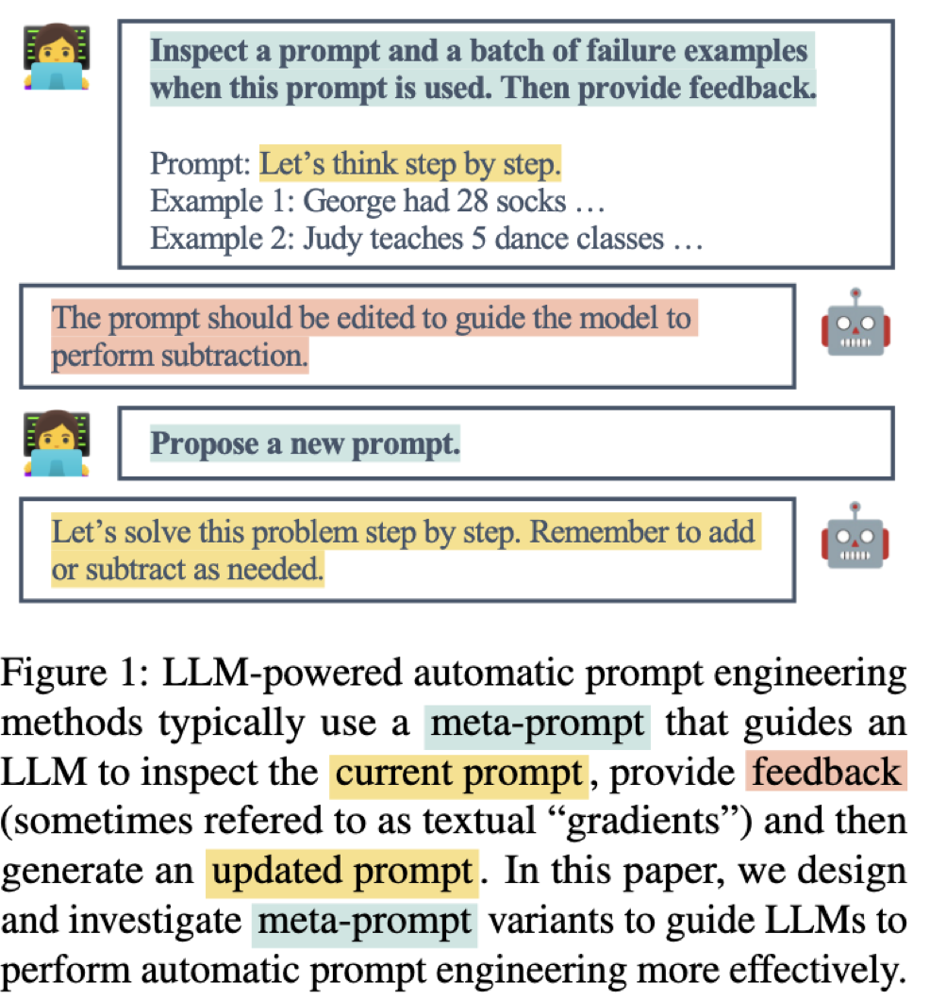

# Prompting

---

## We will focus on text based prompting

::::{.columns style="justify-content: center; align-items: center; align-items: center;"}
:::{.column style="background-color: #ffff; max-width:75%;"}
{alt="A tree showing categories of core prompt techniques. It includes 'text based techniques' as the root element and 'multilingual techniques' and 'multimodal techniques' as the children elements"}
:::
::::


:::{.t-ref}
[The Prompt Report: A Systematic Survey of Prompting Techniques](http://arxiv.org/abs/2406.06608)
:::

---

## Key resources

* [The Prompt Report: A Systematic Survey of Prompting Techniques](http://arxiv.org/abs/2406.06608)
* [Prompt engineering using Instructor](https://python.useinstructor.com/prompting/)

---


## Some definitions first

---


### What's a prompt?

* "A prompt is an input to a Generative AI model, that is used to guide its output"
* "Prompts may consist of text, image, sound, or other media"

---

## Prompting is for [in-context learning (ICL)]{.t-clover}

* “the ability of GenAIs to learn skills and tasks by providing them with exemplars and or relevant instructions within the prompt”

* [**No**]{.t-salmon} retraining of models ([**no**]{.t-salmon} model weight updates)

---


### What’s a prompt template?
* "A prompt template is a function that contains one or more variables which will be replaced by some media (usually text) to create a prompt."
* "a prompt template becomes a prompt when input is inserted into it.”

---

### What’s a prompt template?

* "a prompt template becomes a prompt when input is inserted into it.”

* Template: "Write a poem about {{TOPIC}}”
    + Prompt: "Write a poem about HCAI"


---


#### Can have multiple variables

* "Write a {{POEM FORM}} about {{TOPIC}}”
    + Write a sonnet about HCAI

---


### What’s a prompt template?
* "a prompt template becomes a prompt when input is inserted into it.”

* Prompt or prompt template? 🧐
    + Write a {{POEM FORM}} about HCAI?

---

### Prompt chain

* “two or more prompt templates used in succession”
* “The output of the prompt generated by the first prompt template is used to parameterize the second template, continuing until all templates are exhausted”

---

## Prompt engineering

* “the iterative process of developing a prompt by modifying or changing the prompting technique that you are using”

---


### Prompt components
* Directives
* Examples/Shots/Exemplars
* Output Formatting
* Style
* Role
* Context
    + Additional Information

---

#### Directives — what's to be done?

* Explicit
    + “Write a poem”
* Implicit
    + "Good morning: buen día
    + Good night: "

---

#### Examples/Exemplars/Shots
Demonstrations that guide the GenAI to accomplish a task

---

#### 1-shot
+ "Good morning: buen día
+ Good night: "

---


#### Few-shot

```
2+2: four
4+5: nine
8+0:
```

How many shots?

---

## System prompt from Anthropic

* Todo
    + Take a look at [the system prompt for Claude Opus 4.5](https://platform.claude.com/docs/en/release-notes/system-prompts#claude-opus-4-5)
        + `<refusal_handling>`
        + `<user_wellbeing>`

---

## Text based prompting techniques

---


### Text based prompting techniques — [lots]{.t-salmon} of options!
::::{.columns style="justify-content: center; align-items: center; align-items: center;"}
:::{.column style="background-color: #ffff; max-width:35%;"}
{alt=""}
:::
::::

:::{.t-ref}
[The Prompt Report: A Systematic Survey of Prompting Techniques](http://arxiv.org/abs/2406.06608)
:::

---


## Text based prompting techniques
* Zero-shot
* Few-shot
* Chain of thought (CoT)

---

### Zero-shot prompting techniques

* Role prompting
* Style prompting
* Emotion prompting
* S2A (System 2 Attention)
* Rephrase and Respond (RaR)
* Self-Ask

---

#### Role prompting — assign a role
* “You are a great poet”
* “You are an expert financial advisor”

---

#### Style prompting — desired style

* “Be concise”
* “Respond in songs”

---

#### Emotion prompting — using phrases of "psychological relevance to human"

* "This is very important to my career”

---

#### Emotion prompting — using phrases of "psychological relevance to human"
* "Are you sure that's your final answer? Believe in your abilities and strive for excellence. Your hard work will yield remarkable results"
    + Social Cognitive Theory

:::{.t-ref}
[The Good, The Bad, and Why: Unveiling Emotions in Generative AI](https://arxiv.org/pdf/2312.11111)
:::

---

#### S2A (System 2 Attention)
* Two steps
    + Ask to rewrite the prompt to remove any unnecessary information
    + Use the rewritten prompt for the answer

---

#### Rephrase and Respond (RaR)
* Clarify ambiguous information in the prompt
    + "Rephrase and expand the question"

:::{.t-ref}
[RaR](https://python.useinstructor.com/prompting/zero_shot/rar/)
:::

---

#### Self-Ask
* Decide if follow-up questions are required
    + generate the follow-up questions
    + answer the follow-up questions
    + answer the main query

---

## Text based prompting techniques
* Zero-shot
* Few-shot
* [**Chain of thought (CoT)**]{.t-salmon}

---

### Chain of thought (CoT)
* Explain the reasoning process before answering question
* CoT can be Zero-shot or few-shot

---

### Zero-shot CoT
* Step-back prompting
* Analogical prompting

---

#### Step-back prompting
* Abstraction
    + Ask the LLM a generic, higher-level concept
        + [**Step back question**]{.t-clover}
* Reasoning
    + "Ask the LLM the original question, given its answer to the abstract question”
* [Example](https://python.useinstructor.com/prompting/thought_generation/chain_of_thought_zero_shot/step_back_prompting/)

---

#### Analogical prompting
* “generate examples that are relevant to the problem”
* [Example](https://python.useinstructor.com/prompting/thought_generation/chain_of_thought_zero_shot/analogical_prompting/)

---

### [**Few-shot**]{.t-salmon} CoT
* Contrastive few-shot CoT
    + Exemplars with both [**incorrect**]{.t-salmon} and [**correct**]{.t-clover} for the CoT prompt
        + How to and how not to reason
* [Example](https://python.useinstructor.com/prompting/thought_generation/chain_of_thought_few_shot/contrastive/)

---

## Meta prompting

::::{.columns style="justify-content: center; align-items: center; align-items: center;"}
:::{.column style="background-color: #ffff; max-width:35%;"}
{alt=""}
:::
::::

:::{.t-ref}
[Prompt Engineering a Prompt Engineer](https://arxiv.org/pdf/2311.05661)
:::


---

### Todo
* Create a meta prompt and run it in GPT or Claude


---

## Output formatting
* We often want structured output

* When you are [**using LLMs as a pipeline or infrastructure**]{.t-salmon} for further processing, you want [**consistency**]{.t-clover}

---

### Free form text output is not fun to parse 

::::{.columns style="justify-content: center; align-items: center; align-items: center;"}
:::{.column style="background-color: #ffff; max-width:45%;"}
{alt=""}
:::
::::


---


### We want structured output (using [Instructor](https://python.useinstructor.com/))

```python{data-line-numbers="1"}
import instructor

class Response(BaseModel):
    message: str

r = client.responses.create(
    input="Write a haiku about IST 597 (HCAI)",
    response_model=Response,
)
```

---

### Define the structure of response from LLMs

```python{data-line-numbers="3-4,8"}
import instructor

class Response(BaseModel):
    message: str

r = client.responses.create(
    input="Write a haiku about IST 597 (HCAI)",
    response_model=Response,
)
```

`response_model`: expected structure

---

### Different data types

```python
class User(BaseModel):
    name: str
    age: int
```

:::{.t-ref}
[Understanding Response Models](https://python.useinstructor.com/learning/getting_started/response_models/)
:::

---

### Todo: Using different data types
* Create a new response model that only includes integers (`int`)
* Use it in a prompt that returns an integer
    + What happens if your prompt does not return an integer?

---


### Todo: Anthropic prompt library
* Check [the prompt library](https://platform.claude.com/docs/en/resources/prompt-library/library)
* Pick two of your favorite prompts
    + Do they actually work?

---
